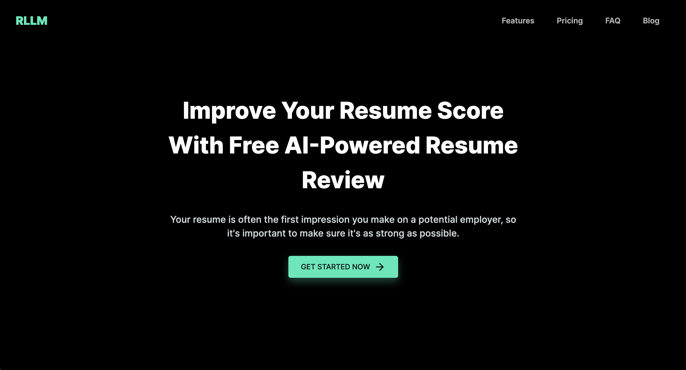
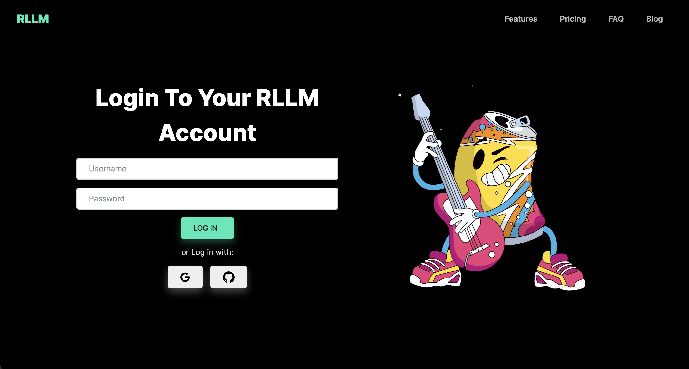

# LLM-Based HR Process Optimization Application

## Overview

The LLM-Based HR Process Optimization Application is a powerful tool that simplifies and enhances HR processes using Language, Logic, and Machine Learning (LLM) techniques. By leveraging Natural Language Processing, machine learning, and analytics, this user-friendly, scalable, and customizable application aims to improve the efficiency, effectiveness, and decision-making in HR operations.

The application seamlessly integrates with existing HR systems and tools, ensuring smooth data flow and compatibility. Its primary objective is to optimize HR processes, reduce manual efforts, enhance decision-making, and elevate the overall employee experience.

## Tech Stack

- The application is open to all and encourages contributions from the community.
- It utilizes a state-of-the-art Large Language Model (LLM) to tackle the HR problem at hand, ensuring robust and accurate results.

## Features

The LLM-Based HR Process Optimization Application offers the following features:

1. **Job Description Evaluation:**
   - The application accepts a job description and evaluates it based on the job title.
   - It provides recommendations for enhancing the job description's effectiveness.
   - Users have the option to either proceed with the original version or incorporate the suggested changes.

2. **CV Ranking:**
   - Multiple CVs in various formats can be uploaded, and the application ranks them based on their alignment with the job requirements.
   - The system shortlists candidates who closely match the job criteria.
   - Additional information about the shortlisted candidates is made available to aid decision-making.

3. **Email Notifications:**
   - The application sends automated email notifications to the shortlisted candidates, informing them about the next steps in the hiring process.
   - This feature streamlines communication and keeps candidates engaged throughout the process.

4. **Screening Questions:**
   - The application generates screening questions for each candidate, considering the relative importance of specific criteria from the job description and the candidate's CV.
   - This approach ensures that the screening process is tailored to individual candidates while keeping the core requirements in mind.

5. **First-Round Interview:**
   - The application conducts the first-round of interviews using a structured approach.
   - It records the candidate's responses to the screening questions for later evaluation.
   - Candidate performances are assessed to determine their suitability for the next in-person round.

6. **Communication:**
   - The application maintains continuous communication with the HR team.
   - It provides regular updates on the hiring process and relevant information to ensure transparency and collaboration.

## Getting Started

To get started with the LLM-Based HR Process Optimization Application, follow these steps:

1. Clone the repository to your local machine.
2. Install the necessary dependencies as specified in the documentation.
3. Launch the application and follow the setup instructions to integrate with your existing HR systems.
4. Begin optimizing your HR processes and enjoy the benefits of improved efficiency and decision-making.

## Contribution Guidelines

We welcome contributions from the community to enhance and expand the functionality of the LLM-Based HR Process Optimization Application. To contribute, please follow the guidelines outlined in CONTRIBUTING.md.

## License

The LLM-Based HR Process Optimization Application is open-source software licensed under the [MIT License](LICENSE). You are free to use, modify, and distribute the software in compliance with the terms specified in the license.

---
